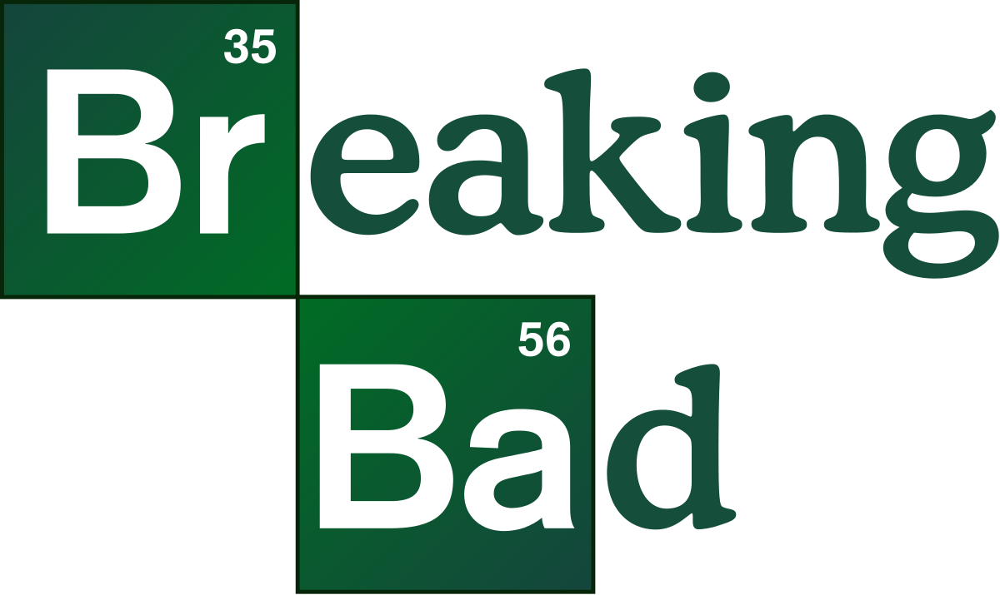
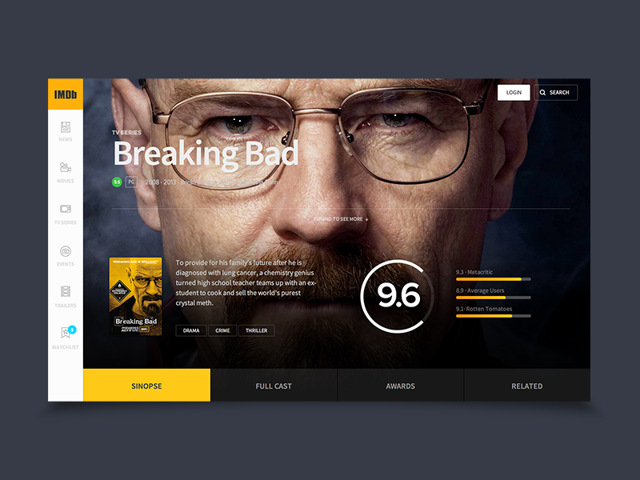

## BREAKING BAD - REACT


## Description 
This projects is created for improve Strive school's students react.js skills. 

# What we will be covering ?

- Props & State concepts
- Functional & Class Components
- AJAX Requests
- Routing in React
- Creating layout
- Theming Application
- Overriding bootstrap styles with className
- Reusable simple components
- Different usages of components (Data display,As container,High order)
- Creating complex component from scratch
- Installing & using  npm packages
- Creating branches & Merging branches
- Deploying application to github pages 


# What we will build ?
Challenge is designing a breaking bad fan page with following this design.




# API SOURCES

* [Breaking Bad Api](https://breakingbadapi.com/documentation)
* [OMDB API](http://www.omdbapi.com/)


### DEPENDENCIES 

```json
    "bootstrap": "^4.5.0",
    "gh-pages": "^3.0.0",
    "react-bootstrap": "^1.0.1",
    "react-circular-progressbar": "^2.0.3",
    "react-icons": "^3.10.0",
    "react-jss": "^10.3.0",
    "react-router-dom": "^5.2.0"
``` 


### TASKS LIST 


- [ ] Analysis of design
- [ ] Defining requirements
- [ ] Splitting everything into simpler components
- [ ] Routing Structure & Layouts & Pages
- [ ] Theming
- [ ] UI components
- [ ] Api Call Functions
- [ ] Passing data to components
- [ ] Integration 
- [ ] Deploy to Github Pages


### BEFORE START

- Clone Boilerplate Project 

```
 git clone https://github.com/ubeytdemirr/breaking-bad-react
 
```
- Change directory to move in project or open project by your IDE

```
    cd breaking-bad-react 

```
- Create A Repo called breaking-bad-react or any name you like 
- Copy your new repo link 
- Since you copied my repo, your remote origin is my repo's link. You should change it to yours in order to push your github

 Check repo links by 

```
    git remote -v
```
 You should see this 
 
```
  origin  https://github.com/ubeytdemirr/breaking-bad-react.git (fetch)
  origin  https://github.com/ubeytdemirr/breaking-bad-react.git (push)

```
Remove old origins by 

```
    git remote remove origin 
```
Then add your new origin by 


```
    git remote add origin  https://www.github.com/yourprofilename/yournewreponame.git
```

Confirm it by git remote -v you should see your new repo 


- Install dependencies

```
    npm i --save  

```


- And start 

```
    npm start 

```

